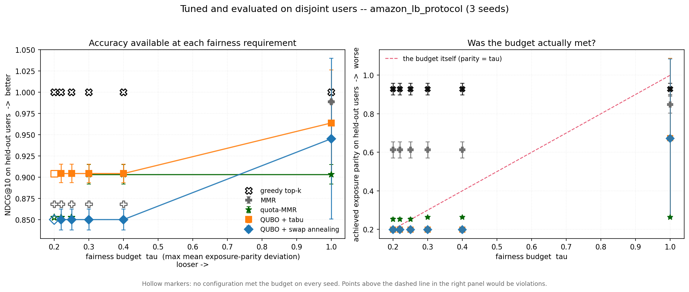
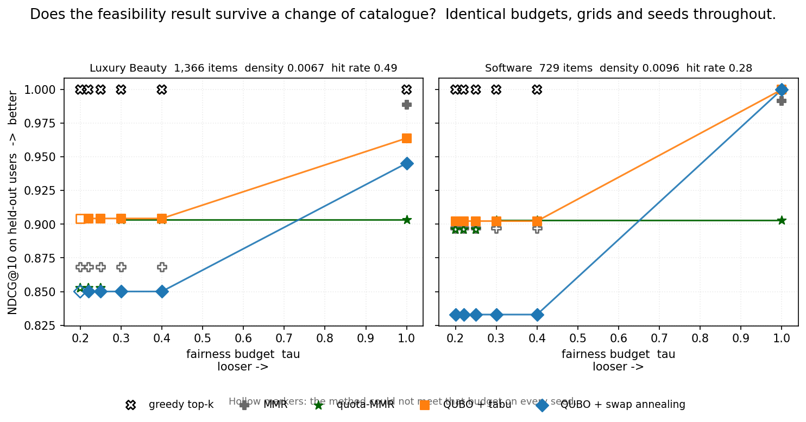
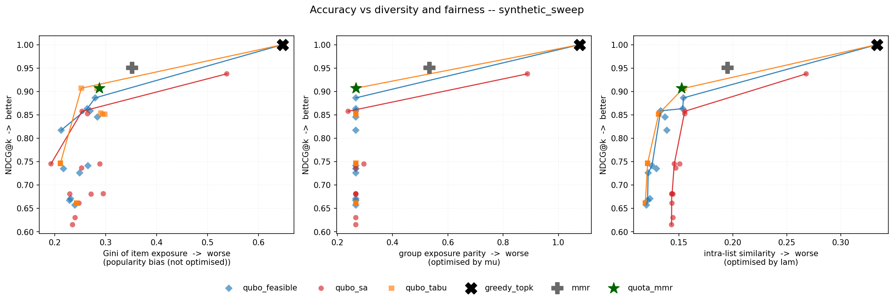
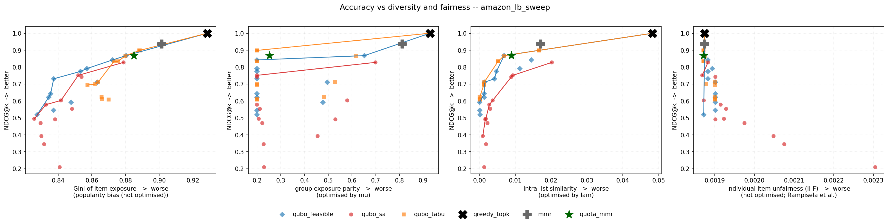

# qubo-rerank

[](https://github.com/OWNER/qubo-rerank/actions/workflows/tests.yml)
[](pyproject.toml)
[](LICENSE)

**Fair and energy-aware recommendation list selection via QUBO.**

Conventional recommenders pick the top-k items greedily by score. The resulting lists are
often redundant (near-identical items) and skewed toward popular sellers. `qubo-rerank`
instead selects the *entire list at once* as a Quadratic Unconstrained Binary Optimization
(QUBO) problem, jointly balancing relevance, diversity, and exposure fairness — and reports
the energy cost of doing so.

> Status: **Phases 1-2 complete, Phase 3 under way** — end-to-end on real data, every
> headline comparison averaged over 5 seeds, and a negative result about the standard
> QUBO recipe that turned out to be the most interesting thing here.

## The formulation

Given `n` candidate items with relevance scores `r_i` and pairwise similarity `s_ij`,
select exactly `k` items by minimising:

```
H  =  −Σ r_i·x_i                        relevance   (reward relevant items)
      + λ Σ s_ij·x_i·x_j                diversity   (penalise similar pairs)
      + P (Σ x_i − k)²                  cardinality (exactly k items)
      + μ Σ_c (Σ_{i∈c} x_i − k/|C|)²    fairness    (even exposure per category)
```

where `x_i ∈ {0,1}` indicates whether item *i* enters the list.

## Findings

1. **The standard QUBO recipe is broken, and it fails silently.** Penalty-encoded
   cardinality plus a single-flip annealer produces lists that are always the right
   length and close to arbitrary among lists of that length. Two fixes are implemented
   here, each ~2× better on the annealer's own objective. Across 5 seeds `qubo_sa`
   scores 0.475 ± 0.030 NDCG against 0.692 ± 0.038 for the fixed solvers — a gap of
   more than five standard deviations.
2. **The choice of `λ` and `μ` decides the QUBO-vs-classical comparison, and it decides
   it by more than the methods differ.** At `λ=4, μ=0` — the configuration this repo's
   headline benchmark uses — every QUBO variant loses to group-quota MMR on essentially
   everything. At `λ=0, μ=1` it does not. An earlier version of this README reported
   only the first and concluded the classical baseline wins; that was an artifact of
   comparing a QUBO with its fairness term switched **off** against a baseline with
   group quotas built in.
3. **Under a protocol that tunes every method on one half of the users and scores it on
   the other, the QUBO's advantage is not accuracy — it is feasibility.** At a fairness
   requirement of `τ ≤ 0.25`, no classical baseline can satisfy the constraint at *any*
   setting of its own hyperparameters, while `qubo_tabu` can and still returns NDCG
   0.904. Loosen the requirement to `τ ≥ 0.30` and quota-MMR becomes feasible and the
   accuracy gap closes: 0.9033 ± 0.0115 against 0.9043 ± 0.0109. A paired test over 200
   users finds that residual gap is *real* — p ≈ 2×10⁻⁷ — and that its median size is
   **0.0012 NDCG**. Certain, and negligible.
4. **That feasibility result holds on 3 of 3 catalogues** differing by an order of
   magnitude in size and 6.6× in density. It is strongest on the smallest and densest,
   where the QUBO takes both a tighter budget and +0.20 NDCG.
5. **It still costs ~100× the compute** (16.1 s against 0.16), and `quota_mmr` still
   wins intra-list similarity outright.

(1) is why (3) is worth trusting: without the barrier fix the solver never optimises
well enough for the operating point to matter. Numbers in [Results](#results).

> An intermediate version of this file claimed the QUBO beat quota-MMR on NDCG as well.
> That margin was measured with `λ` and `μ` selected on the same dataset they were
> scored on, and it **did not survive** the disjoint-split protocol. What survived is
> (3), which is a narrower claim and a more useful one — it says *when* to reach for a
> QUBO rather than that it is better.

### 1. The penalty encoding breaks the sampler

The textbook recipe — encode `exactly k` as a penalty `P(Σx − k)²`, hand the BQM to a
simulated annealer — **does not work at realistic candidate-set sizes**, and it fails
*silently*.

The mechanism is structural, not a matter of tuning. Two feasible k-sets are never
adjacent under single-spin-flip moves: getting from one to another means removing an item
and adding another, and the state in between has `k±1` items and therefore costs the full
penalty `P`. So the sampler faces a dilemma with no good side:

- cold enough to resolve the objective → it cannot cross the barrier, and freezes in
  whichever feasible set it first stumbled into;
- hot enough to cross the barrier → the objective is thermal noise.

On Amazon Luxury Beauty (`n=200`, `k=10`), the cardinality term's largest coefficient is
**737.8** against the objective's **1.0**. Measured consequences:

- `neal` returns lists of exactly the right length **100% of the time** — the constraint
  is satisfied, so nothing looks wrong.
- Its mean QUBO energy is **worse than a greedy MMR baseline** evaluated on the same BQM.
  A hand-written heuristic beats simulated annealing at minimising the annealer's own
  objective.
- Raising `num_sweeps` 10× makes it **slightly worse, not better** — the giveaway that
  more search cannot help when the search is looking at the wrong scale.
- Lowering the penalty strength does not help either: the barrier height *is* the
  strength, and a strength low enough to cross is too low to enforce the constraint.

Two fixes, both in the repo, both beating `neal` by ~2× on its own objective:

| solver | idea | keeps generic `dimod` sampler? |
|---|---|---|
| `qubo_tabu` | same BQM, same single-flip move set, but with **search memory** | yes |
| `qubo_feasible` | anneal over **k-subsets** via swap moves; the barrier never exists | no |

And one that does **not** fix it, which turns out to be the more informative result —
see [Continuous dynamics fail too](#continuous-dynamics-fail-too).

That `qubo_tabu` also works is what rules out the *formulation* as the culprit: a generic
single-flip sampler can solve this BQM given a strategy that escapes basins deliberately
rather than thermally. The problem is the interaction between penalty encoding and
thermal search, which is why D-Wave ships constrained (CQM) solvers rather than expecting
users to tune penalty weights.

**Why this matters for the quantum framing.** A physical annealer receives the same
penalty-encoded BQM and the same barrier. This result is a concrete, measured argument for
constraint-aware solvers over generic QUBO sampling in recommendation reranking — and a
caution against reporting "QUBO reranking achieves good diversity" without checking
whether the sampler optimised anything at all. A near-random feasible list scores *well*
on diversity and coverage. Reporting only downstream metrics would have hidden this
completely.

### Continuous dynamics fail too

The barrier argument above is about **move sets**: two valid k-item lists are never
adjacent under bit flips, so a single-flip sampler has to climb the full penalty to get
between them. That argument says nothing about a method with no move set at all.

Simulated Bifurcation (Goto et al., *Science Advances* 2019) is exactly that method. It
gives each variable a position and a momentum, integrates a Hamiltonian system while a
control parameter is ramped until each variable bifurcates toward one of two attractors,
and reads the spins off the signs at the end. In between, the state is a point in
continuous space that is not any particular bit vector — it travels through the interior
of the hypercube rather than along its edges. If the penalty encoding were merely
hostile to *discrete local search*, this should sail past it.

**It does worse than anything else here. On the barrier instance it returns the empty
set** — at 600 and at 2000 steps, in both the ballistic and discrete variants.

The mechanism is different from the barrier, and the conclusion is the same. Penalty-
encoded cardinality couples every pair of items positively, so converting to Ising form
leaves a large *uniform* field: mean **4.7413** with a spread of **0.0024**. The signal
that distinguishes one item from another is 5×10⁻⁴ of the common mode. Every variable
feels essentially the same drive, so they all bifurcate together, and the answer is
"select nothing". Sweeping the penalty strength shows the dependence directly:

| penalty strength | field spread ÷ mean | items selected (target 10) |
|---|---|---|
| 277.8 (the value that enforces the constraint) | 5.0×10⁻⁴ | **0** |
| 27.8 | 5.0×10⁻³ | **0** |
| 8.3 | 1.6×10⁻² | **0** |
| 2.8 | 4.5×10⁻² | 9 |
| 0.8 | 1.2×10⁻¹ | 2 |

Simulated Bifurcation only sees the objective once the penalty falls roughly 100×
*below* the strength needed to enforce the constraint — which is `neal`'s dilemma
restated in continuous form.

**This sharpens the repo's central claim.** It is not that thermal search is the
problem:

| solver | paradigm | outcome |
|---|---|---|
| `qubo_sa` | discrete, thermal | fails |
| `qubo_sb` | **continuous dynamics** | **fails worse** |
| `qubo_tabu` | discrete + explicit memory | works |
| `qubo_feasible` | constraint-preserving moves | works |

What rescues the formulation is not a better search. It is either **memory** or **never
leaving the feasible set**. Two solvers from unrelated paradigms both fail when handed
the penalty encoding unaided, which is a stronger argument for constraint-aware solvers
than either failure alone.

**A caution about this result, since it is a negative one.** A negative result from a
broken implementation is easy to produce by accident, so `tests/test_bifurcation.py`
establishes correctness before it establishes failure: the solver recovers the
exhaustive optimum on 8 of 8 random dense QUBOs, and its QUBO→Ising conversion is checked
numerically. That check earned its place — the conversion had a factor-of-two error when
first written (`J/8` where `J/4` was needed), which is invisible in the output because
the result is still a perfectly plausible Ising problem, just a different one. It is
still possible that a specialist SB implementation with problem-specific tuning would do
better; what is not in doubt is the mechanism, which is a property of the encoding rather
than of any solver.

### 2. The operating point decides the comparison

The headline benchmark below runs at `λ=4, μ=0`, and at that setting every QUBO variant
loses to group-quota MMR on essentially everything. It is tempting to stop there and
report that the classical baseline wins — an earlier version of this README did exactly
that.

It is not a fair comparison. `μ=0` switches the fairness term **off**, so it pits a QUBO
optimising relevance-and-diversity against a baseline with group quotas hard-coded, and
then scores both on group exposure parity. `λ=4` came from `loader.suggest_lam`, a
scale-matching heuristic with no claim to being a good operating point.

Re-run at `λ=0, μ=1` — the region the sweep pointed at — over 5 seeds, 60 users:

| method | NDCG@10 | exposure parity ↓ | ILS ↓ | secs ↓ |
|---|---|---|---|---|
| quota_mmr | 0.8505 ± 0.0203 | 0.2576 ± 0.0034 | **0.0094 ± 0.0008** | **0.16 ± 0.00** |
| **qubo_tabu** | **0.8873 ± 0.0067** | **0.1999 ± 0.0024** | 0.0177 ± 0.0014 | 16.05 ± 0.05 |
| qubo_feasible | 0.8319 ± 0.0039 | **0.1999 ± 0.0024** | 0.0151 ± 0.0015 | 38.91 ± 3.63 |

`qubo_tabu`'s NDCG range `[0.876, 0.893]` and `quota_mmr`'s `[0.814, 0.863]` do not
overlap; neither do the parity ranges, `[0.197, 0.202]` against `[0.254, 0.262]`.

> **The NDCG half of that does not survive.** Both methods here are being run at fixed
> weights — `λ=0, μ=1` for the QUBO, `mmr_lam=0.5` for the baseline — and the QUBO's
> came from inspecting a sweep while the baseline's is simply the repo default. Tune
> both properly, on users held out from the scoring, and `quota_mmr` reaches
> 0.9033 ± 0.0115 against `qubo_tabu`'s 0.9043 ± 0.0109: a tie. The parity gap does
> survive. See [Tuning and evaluation on disjoint users](#tuning-and-evaluation-on-disjoint-users),
> which is the comparison to read. This section is kept because the `λ=4, μ=0` versus
> `λ=0, μ=1` contrast is still the clearest demonstration of how much the operating
> point matters.

Three things stop this being a rescue of the method:

- **`quota_mmr` still wins intra-list similarity outright**, by a non-overlapping margin.
  Whether that matters depends on whether you care about redundancy within one list or
  exposure across groups; they are different goals and the two methods split them.
- **The cost ratio is unchanged**: 16.1 seconds against 0.16, a factor of ~100. Nothing
  here argues QUBO reranking is *practical* at this scale, only that it is not beaten on
  quality.
- **The win is `qubo_tabu`'s, not the QUBO's.** `qubo_feasible` scores 0.832 at the same
  operating point — below the baseline — while being given ~2.4× the wall-clock. A
  formulation-level claim would need both solvers to show it, and only one does.
- **`qubo_tabu` is the solver whose result is least portable.** It stops on a wall-clock
  timeout, so the margin above is partly a property of this CPU; see
  [the note on tabu's stopping criterion](#evaluation-choices-that-change-the-numbers).

**The methodological caveat, which is the real limitation.** `λ` and `μ` were chosen by
looking at a 40-user sweep and then validated on 5 resamples of 60 users from the same
dataset. The resamples are independent draws, so this is not the same as reporting the
best sweep cell — but selection and evaluation still share a dataset. A clean protocol
splits users into disjoint selection and evaluation sets and tunes only on the first.
Until that is done, read this as *the QUBO has an operating point that beats the
baseline on two axes*, not as *the QUBO beats the baseline*. Doing it properly is the
first item in Phase 2, and it matters more than another dataset would.

## Results

### Synthetic benchmark (n=60, k=10, 25 users)

| method | NDCG@10 | cat. cov. | parity ↓ | ILS ↓ | cat. coverage | Gini ↓ | secs ↓ | kWh ↓ |
|---|---|---|---|---|---|---|---|---|
| greedy_topk | **1.0000** | 0.533 | 1.0773 | 0.3336 | 0.600 | 0.6472 | **0.00** | 1.7e-07 |
| mmr | 0.9502 | **1.000** | 0.5333 | 0.1952 | **1.000** | 0.3516 | 0.02 | **2.0e-09** |
| quota_mmr | 0.9072 | **1.000** | **0.2667** | 0.1524 | **1.000** | 0.2872 | 0.02 | **2.0e-09** |
| qubo_sa | 0.7448 | 0.993 | 0.2960 | 0.1508 | 0.967 | 0.2887 | 7.44 | 2.4e-05 |
| qubo_tabu | 0.8510 | **1.000** | **0.2667** | **0.1312** | 0.967 | 0.2984 | 5.54 | 1.8e-05 |
| qubo_feasible | 0.8585 | **1.000** | **0.2667** | 0.1331 | 0.983 | **0.2696** | 3.96 | 1.3e-05 |

Over 5 seeds (`results/synthetic_repeats.csv`):

| method | NDCG@10 | parity ↓ | Gini ↓ | secs ↓ |
|---|---|---|---|---|
| greedy_topk | 1.0000 ± 0.0000 | 1.0768 ± 0.0158 | 0.6423 ± 0.0050 | 0.00 ± 0.00 |
| mmr | 0.9499 ± 0.0018 | 0.5301 ± 0.0072 | 0.3814 ± 0.0175 | 0.03 ± 0.00 |
| quota_mmr | 0.9110 ± 0.0034 | **0.2667 ± 0.0000** | 0.2877 ± 0.0107 | 0.03 ± 0.01 |
| qubo_sa | 0.7404 ± 0.0105 | 0.3045 ± 0.0208 | **0.2686 ± 0.0243** | 7.29 ± 0.03 |
| qubo_tabu | 0.8652 ± 0.0088 | **0.2667 ± 0.0000** | 0.2877 ± 0.0218 | 5.53 ± 0.00 |
| qubo_feasible | **0.8666 ± 0.0049** | **0.2667 ± 0.0000** | 0.2803 ± 0.0233 | 3.87 ± 0.05 |

`qubo_feasible` trades 0.044 NDCG against `quota_mmr` for a better Gini (0.2803 vs
0.2877) and lower intra-list similarity — a real Pareto trade, but one costing **~130×
the wall-clock**. It does dominate `qubo_sa` outright: +0.13 NDCG, better parity, and
roughly half the time.

The two fixed solvers are indistinguishable here — 0.8666 ± 0.0049 against
0.8652 ± 0.0088 — which is the point of running seeds at all. On a single seed
`qubo_feasible` looks 0.008 better and it would have been easy to write that up as an
ordering.

Two things the λ/μ sweep shows (`results/synthetic_sweep.csv`):

**λ behaves as it should**, and the solver is verifiably optimising. At λ=0 the objective
is pure relevance, so the optimum is exactly greedy top-k — and `qubo_feasible` returns
NDCG **1.0000**, recovering the known answer outright. As λ rises 0 → 16, NDCG falls
1.000 → 0.657 and intra-list similarity falls 0.334 → 0.120.

**μ works, but λ makes it redundant here.** The entire 4×3 grid produces only *two*
distinct `exposure_parity` values: 1.0773 at (λ=0, μ=0), and 0.2667 everywhere else —
which is its arithmetic floor for 6 groups and k=10 (four groups get 2 slots, two get 1).
So μ genuinely fixes parity when nothing else is, but any λ≥1 already drives it to the
floor on its own. The synthetic generator makes items within a category mutually similar,
so diversity and fairness are the same axis by construction and there is no trade-off
curve to trace. This is exactly why the real dataset matters: there, groups are popularity
tiers, which are *not* aligned with the similarity structure, and μ traces a real curve.

### Amazon Luxury Beauty (n=200, k=10, 200 users, λ=4, μ=0)

Recall's ceiling is **0.49** — the fraction of users whose held-out item was in the
top-200 candidate set at all. Read `recall@10` against that, not against 1.0.

| method | NDCG@10 | recall@10 | cat. cov. | parity ↓ | ILS ↓ | cat. coverage | Gini ↓ | AI-F ↓ | IBO | secs ↓ | kWh ↓ |
|---|---|---|---|---|---|---|---|---|---|---|---|
| greedy_topk | **1.0000** | **0.250** | 0.610 | 0.9983 | 0.0524 | 0.326 | 0.8776 | 2.4e-04 | 0.366 | **0.00** | **1.8e-07** |
| mmr | 0.9159 | 0.245 | 0.733 | 0.8225 | 0.0189 | 0.441 | 0.7924 | 1.3e-04 | **0.380** | 0.67 | 2.1e-06 |
| quota_mmr | 0.8369 | 0.225 | **1.000** | **0.2607** | 0.0095 | 0.510 | 0.7342 | 9.9e-05 | 0.324 | 0.51 | 1.6e-06 |
| qubo_sa | 0.4370 | 0.170 | 0.910 | 0.5205 | 0.0020 | **0.667** | **0.5824** | **3.7e-05** | 0.197 | 360.24 | 1.2e-03 |
| qubo_tabu | 0.6648 | 0.200 | 0.882 | 0.5643 | **0.0014** | 0.540 | 0.7160 | 6.3e-05 | 0.268 | 56.49 | 1.8e-04 |
| qubo_feasible | 0.6593 | 0.205 | 0.887 | 0.5283 | **0.0014** | 0.560 | 0.6975 | 5.6e-05 | 0.282 | 108.42 | 3.5e-04 |

Over 5 seeds at 60 users (`results/amazon_lb_repeats.csv`):

| method | NDCG@10 | recall@10 | parity ↓ | Gini ↓ | secs ↓ |
|---|---|---|---|---|---|
| greedy_topk | 1.0000 ± 0.0000 | 0.317 ± 0.103 | 0.9902 ± 0.0698 | 0.9201 ± 0.0156 | 0.00 ± 0.00 |
| mmr | 0.9241 ± 0.0137 | 0.307 ± 0.090 | 0.8189 ± 0.0408 | 0.8759 ± 0.0155 | 0.20 ± 0.01 |
| quota_mmr | 0.8505 ± 0.0203 | 0.283 ± 0.075 | **0.2576 ± 0.0034** | 0.8436 ± 0.0183 | 0.16 ± 0.00 |
| qubo_sa | 0.4749 ± 0.0296 | 0.220 ± 0.089 | 0.5162 ± 0.0300 | **0.7693 ± 0.0306** | 107.67 ± 0.27 |
| qubo_tabu | 0.6915 ± 0.0384 | 0.260 ± 0.085 | 0.5322 ± 0.0170 | 0.8284 ± 0.0272 | 16.88 ± 0.06 |
| qubo_feasible | 0.6881 ± 0.0400 | 0.260 ± 0.085 | 0.5499 ± 0.0282 | 0.8262 ± 0.0260 | 33.34 ± 1.47 |

**At this operating point the classical baseline wins,** and by a wide margin:
`quota_mmr` beats every QUBO variant on NDCG (0.851 vs 0.692), recall, exposure parity
(0.258 vs 0.532) and IBO — in **0.16 seconds against 17**. The fixed solvers rescue the
QUBO from `qubo_sa`'s 0.475 NDCG, but at `λ=4, μ=0` they rescue it into second place.

**This is the wrong operating point, and it is the one this config picks.** `μ=0` means
the fairness term is off, so the QUBO is being scored on group exposure parity while
having been given no reason to optimise it. [Section 2](#2-the-operating-point-decides-the-comparison)
re-runs it at `λ=0, μ=1`, where the picture reverses. Both tables are real; the
difference between them is a configuration choice, and it is larger than the difference
between the methods.

The table is kept at `λ=4, μ=0` rather than quietly re-run at the flattering setting,
because the gap between the two is the most useful thing on this page.

For the comparison that settles it — every method tuned under the same rule on users
held out from the scoring — see
[Tuning and evaluation on disjoint users](#tuning-and-evaluation-on-disjoint-users).

Where the QUBO does win — Gini, catalogue coverage, intra-list similarity, AI-F — deserves
scepticism rather than celebration. Every one of those is improved by *spreading selections
around*, which is also what a bad optimiser does by accident. `qubo_sa` "wins" Gini
(0.5824), catalogue coverage (0.667) and AI-F outright, and it is the method demonstrably
closest to picking at random. That is precisely why the energy column and the
solver-energy diagnostics are in this repo: without them, the worst optimiser here looks
like the fairest method.

II-F is not reported per-method above because it barely discriminates: every method lands
between 0.002083 and 0.002138, a 2.6% spread across solvers whose NDCG differs by a
factor of two. Under leave-one-out there is one relevant item per user against a
1,365-item catalogue, so the measure is dominated by the shared sea of zeros — the same
degeneracy flagged in `metrics/dpfr.py`. It is in the CSV; it should not carry an
argument.

**What would change this verdict.** The QUBO is being asked to beat a strong greedy
heuristic on a 200-item candidate set, where exhaustive-ish search has little room to pay
off. The case for it has to come from Phase 3 — larger candidate sets where greedy's
myopia actually costs something, and constraints (per-seller contracts, hard slot quotas)
that MMR cannot express but a QUBO can. On this benchmark, at this size, it does not.

### What the λ/μ sweep shows on real data

Grid: λ ∈ {0, 1, 4, 16} × μ ∈ {0, 1, 4}, 40 users, all three QUBO solvers
(`results/amazon_lb_sweep.csv`). Baselines for the figure are re-run on the same 40
users and written to `results/amazon_lb_sweep_baselines.csv`.

**The solver is verifiably optimising.** At λ=0, μ=0 the objective is pure relevance, so
the optimum is exactly greedy top-k — and it returns NDCG **1.0000** on a 200-variable
instance. That is the one problem size here whose answer is known independently, and it
gets it exactly right.

**μ does real work here, unlike on the synthetic benchmark.** Turning μ from 0 to 1 moves
exposure parity from 0.929 to **0.199** — its arithmetic floor for 4 groups and k=10 — and
category coverage from 0.635 to **1.000**, at any λ. Popularity tiers are not aligned with
the similarity structure, so the diversity term cannot reach this on its own and the
fairness term has something to do.

**NDCG substantially overstates what fairness costs.** Going from (λ=0, μ=0) to
(λ=4, μ=1):

| | NDCG@10 | recall@10 | parity | cat. coverage |
|---|---|---|---|---|
| λ=0, μ=0 | 1.0000 | 0.3250 | 0.9292 | 0.6354 |
| λ=4, μ=1 | 0.6429 | 0.2750 | **0.1992** | **1.0000** |
| change | −36% | **−15%** | −79% | +57% |

NDCG here is computed against the retrieval model's *own* scores, so it is maximised by
definition when you simply agree with the model — reranking away from it always looks
expensive. Recall is measured against a genuinely held-out purchase. By that measure,
driving exposure parity down by 79% and taking category coverage to 100% costs 15% of
predictive accuracy, not 36%. **Papers that report only NDCG overstate the price of
fairness by roughly a factor of two on this data.** This is the most transferable result
here and it does not depend on the QUBO at all.

**Diversity and individual-item fairness pull against each other.** IBO falls from 0.667
to 0.444 as λ rises 0 → 4. Spreading a list across dissimilar items is not the same as
giving individual items their due exposure, and optimising the first can damage the
second.

### Tuning and evaluation on disjoint users

Everything above selects `λ` and `μ` by looking at a sweep over the same dataset the
result is then reported on. Re-validating on fresh user samples narrows the problem but
does not remove it: part of any reported margin is a measure of how many grid cells were
tried. `experiments/protocol.py` removes it.

**The protocol.** Split the sampled users into two disjoint halves. Declare a fairness
budget `τ` — an upper bound on mean exposure-parity deviation, the way a deployer would
actually state the requirement. Tune **every** method on the tuning half by maximising
NDCG@10 subject to `parity ≤ τ`. Evaluate the chosen configuration once, on the other
half. Repeat over seeds, and sweep `τ`.

Two details do most of the work:

- **The baselines are tuned too.** `mmr` and `quota_mmr` have a `λ` of their own, left
  at 0.5 everywhere else in this repo. Searching the QUBO's two weights while leaving
  the baseline's one at its default is the same asymmetry that made the original
  conclusion wrong, pointed the other way. Here `quota_mmr` genuinely uses its search —
  it picks `mmr_lam=0.7` under tight budgets and `0.3` under loose ones.
- **Selection is constrained.** Maximising NDCG alone always returns `λ=0, μ=0`, which
  *is* greedy top-k: NDCG 1.0 by construction and the worst parity available. A method
  that cannot meet the budget is flagged infeasible rather than quietly reported at its
  least-bad setting next to methods that met it.

NDCG@10 on held-out users, 3 seeds, 40 tuning / 40 evaluation users
(`results/amazon_lb_protocol.csv`). `--` means no configuration met the budget on every
seed:

| fairness budget τ | 0.20 | 0.22 | 0.25 | 0.30 | 0.40 | 1.00 |
|---|---|---|---|---|---|---|
| greedy_topk | -- | -- | -- | -- | -- | **1.0000** |
| mmr | -- | -- | -- | -- | -- | 0.9887 |
| quota_mmr | -- | -- | -- | 0.9033 | 0.9033 | 0.9033 |
| **qubo_tabu** | -- | **0.9043** | **0.9043** | **0.9043** | **0.9043** | 0.9639 |
| qubo_feasible | -- | 0.8501 | 0.8501 | 0.8501 | 0.8501 | 0.9453 |



**Three regimes, and they are the actual result.**

*Tight (`τ = 0.22, 0.25`).* Only the QUBO methods meet the budget at all. `quota_mmr`
achieves 0.2517 ± 0.0067 parity at best — it cannot get under 0.25 reliably at any
`mmr_lam`, because a quota mechanism can only redistribute slots it has. The QUBO's
penalty targets the parity objective directly and reaches 0.1983 ± 0.0017, essentially
the arithmetic floor. **This is the regime where QUBO reranking does something no
baseline here can do**, and it is a feasibility claim, not an accuracy one.

*Moderate (`τ = 0.30, 0.40`).* `quota_mmr` becomes feasible and the accuracy gap closes
to nothing: 0.9033 ± 0.0115 against `qubo_tabu`'s 0.9043 ± 0.0109. The QUBO still
delivers strictly better parity (0.1983 vs 0.2625, non-overlapping), so it buys fairness
headroom rather than accuracy — at ~100× the compute.

*Unconstrained (`τ = 1.00`).* Greedy top-k wins by definition. Both QUBO solvers select
`λ=0, μ=0` and return NDCG **1.0000**, recovering greedy exactly. That is the protocol's
built-in correctness check: told that fairness does not matter, the tuner correctly
concludes the QUBO should not be used.

The selection is stable — `λ=0, μ=1` is chosen at every constrained budget on every
seed — which matters, because an unstable selection would mean the tuning half was too
small to choose from reliably.

**What is still weak.** Three seeds and 40 evaluation users is a small sample, and the
`τ=0.20` column shows it: the QUBO's parity of 0.1983 ± 0.0017 straddles the budget, so
it is marked infeasible on the seeds where tuning landed just above. A paired per-user
test would extract far more from the same runs than comparing means over three seeds,
and is the next item in Phase 2.

### Does it hold on more than one catalogue?

The feasibility result is stated as a claim about *methods*. It could equally be a claim
about Amazon Luxury Beauty's popularity structure, and one dataset cannot tell those
apart. So the whole protocol was re-run, unchanged, on two more Amazon categories chosen
to differ in the ways that should matter:

| | Luxury Beauty | Software | Gift Cards |
|---|---|---|---|
| interactions (5-core) | 32,732 | 12,454 | 2,960 |
| users / items | 3,589 / 1,366 | 1,779 / 729 | 456 / 147 |
| density | 0.0067 | 0.0096 | **0.0442** |
| candidate-set ceiling on recall | 0.49 | 0.28 | — |
| candidates reranked | 200 | 200 | 100 |

Identical budgets, grids and seeds throughout — nothing is tuned per catalogue.

**Reach** — the tightest fairness budget each method meets *on every seed*. Lower is a
stronger guarantee:

| method | Gift Cards | Luxury Beauty | Software |
|---|---|---|---|
| greedy_topk | — | — | 1.00 |
| mmr | 1.00 | 1.00 | 1.00 |
| quota_mmr | 0.25 | 0.30 | 0.30 |
| **qubo_tabu** | **0.20** | **0.22** | **0.20** |
| **qubo_feasible** | **0.20** | **0.22** | **0.20** |

NDCG@10 delivered at that tightest budget:

| method | Gift Cards | Luxury Beauty | Software |
|---|---|---|---|
| quota_mmr | 0.5540 | 0.9033 | 0.9031 |
| **qubo_tabu** | **0.7589** | 0.9043 | 0.9023 |
| qubo_feasible | 0.7253 | 0.8501 | 0.8329 |



**Holds on 3 of 3.** And Gift Cards is the interesting one — it was included precisely
because it was the case most likely to break the result, being small and dense enough
that a greedy heuristic has room to do well. Instead the QUBO wins *both* axes there:
a tighter reach **and** +0.20 NDCG at it. That matches what the config predicted before
the run: small `n` is exactly where exhaustive-ish search should pay off, which makes it
a fair place to look for the method's best case rather than a hostile one.

**Why quota-MMR stalls, mechanically.** Its reach is 0.30 on both 200-candidate
datasets, and the arithmetic floor for k=10 over 4 groups is 0.20. That gap is not about
data: quota-MMR fills group quotas greedily and cannot backtrack, so a slot spent early
on a group that later proves cheap to fill is not recoverable. The QUBO chooses the
whole allocation at once and reaches the floor. Gift Cards' smaller candidate set
loosens the constraint enough for quota-MMR to reach 0.25, which is consistent with the
same explanation.

**This is the strongest claim in the repo**, and it is a claim about *when* to use the
method rather than that the method is better: below a group-exposure requirement of
roughly 0.25, the classical rerankers tested here cannot satisfy the constraint at any
setting of their own hyperparameters, and the QUBO can.

### Paired per-user tests

Comparing means over 3 seeds is a test with n=3. But every method sees the **identical
candidate set for the identical user**, so their per-user scores are paired observations
— and that is a test with n=200 on data already collected. The seeds were never the
sample; the users are. Pairing also cancels the dominant variance term: users differ
enormously in how predictable they are, and a user whose held-out purchase never entered
the candidate set scores badly under every method.

Wilcoxon signed-rank, two-sided, Holm-corrected across all 20 comparisons in the run.
200 users, `λ=0, μ=1`, everything measured against `quota_mmr`
(`results/amazon_lb_paired.csv`):

| metric | method | median diff | 95% CI | better/worse/tied | p (Holm) |
|---|---|---|---|---|---|
| **exposure parity ↓** | qubo_tabu | **−0.1000** | [−0.1000, −0.1000] | 115 / **0** / 85 | 3e-25 |
| | qubo_feasible | **−0.1000** | [−0.1000, −0.1000] | 115 / **0** / 85 | 3e-25 |
| **NDCG@10 ↑** | qubo_tabu | **+0.0012** | [+0.0012, +0.0043] | 127 / 63 / 10 | 2e-07 |
| | qubo_feasible | −0.0426 | [−0.0514, −0.0282] | 54 / 146 / 0 | 2e-04 |
| | qubo_sa | −0.1362 | [−0.1542, −0.1084] | 33 / 167 / 0 | 8e-22 |
| **recall@10 ↑** | qubo_tabu | 0.0000 | [0.0000, 0.0000] | 5 / 1 / 194 | 0.57 |
| **intra-list sim ↓** | qubo_tabu | +0.0022 | [+0.0022, +0.0040] | 25 / 166 / 9 | 2e-27 |

**Significant and negligible are not opposites, and the NDCG row is why this matters.**
The seed-level comparison called `qubo_tabu` vs `quota_mmr` a tie — 0.9043 ± 0.0109
against 0.9033 ± 0.0115. The paired test, with far more power, finds the difference is
**real**: p ≈ 2×10⁻⁷, better on 127 users against 63. And its median size is
**0.0012 NDCG**, with the interval topping out at 0.0043. Both readings are correct, and
reporting either one alone would mislead. A table of p-values would have called this a
win; a table of means called it a tie; it is a certain difference of almost no size.

**The parity result has the opposite shape and is the one that carries weight.** A median
improvement of 0.10, and **worse on zero users out of 200**. Not a marginal edge — a
uniform one, and the same effect the fairness-budget curve shows from the other
direction.

**Recall does not move for any method** (194 of 200 users tied). Under leave-one-out
there is at most one relevant item per user and the candidate-set ceiling is 0.49, so
most users score identically under every reranker. Reporting a recall difference on this
benchmark would be reporting noise.

Two results the pairing strengthens rather than changes: `qubo_sa` sits at −0.136 NDCG
against the baseline (p ≈ 8×10⁻²²), so the penalty-barrier finding now rests on 200
paired observations rather than seed means; and `qubo_feasible` is **significantly worse
than the classical baseline** at −0.043, which settles that the QUBO's advantage here
belongs to `qubo_tabu` specifically and not to the formulation.

> Read the interval, not the star. With 200 users a p-value of 10⁻²⁵ reports
> *consistency*, not magnitude — `qubo_tabu` improves parity on every single user who
> changes at all, which is what drives p down, and says nothing by itself about whether
> 0.10 is a lot. The effect sizes and counts are in the table for that reason.

### Trade-off curves





Each panel plots NDCG against one cost axis; the classical baselines are fixed reference
points, computed on the same user sample as the sweep. The question is not whether the
QUBO curve *moves* — any reranker moves — but whether any point on it sits above and to
the left of `quota_mmr` (green star), i.e. more accurate *and* cheaper on that axis.

On group exposure parity it does: `qubo_tabu` at `λ=0, μ=1` reaches NDCG 0.899 at parity
0.199, against `quota_mmr`'s 0.868 at 0.253. That single point is what prompted the
5-seed re-test in [Section 2](#2-the-operating-point-decides-the-comparison), and it is
the whole reason the headline claim changed. It is also a good argument for drawing the
figure before writing the conclusion: the same data, plotted against matched baselines,
had been sitting in an earlier sweep whose baselines came from a different user sample
and so could not be compared to it at all.

On Gini it does not, at any grid point — and Gini is the axis nothing here optimises.

## Reproducing

```bash
python -m venv .venv
source .venv/Scripts/activate          # Windows / Git Bash
pip install -r requirements.txt

# ~24 MB, downloaded once
curl --create-dirs -o data/amazon_lb/Luxury_Beauty.csv \
  https://mcauleylab.ucsd.edu/public_datasets/data/amazon_v2/categoryFilesSmall/Luxury_Beauty.csv

pytest tests/ -q

python experiments/run_experiment.py --config configs/synthetic.yaml
python experiments/run_experiment.py --config configs/amazon_lb.yaml

# repeat studies -- 5 seeds, resampling users and solver seeds together
python experiments/run_experiment.py --config configs/synthetic.yaml --repeats 5
python experiments/run_experiment.py --config configs/amazon_lb.yaml --repeats 5 --n-users 60

# the sweep also writes amazon_lb_sweep_baselines.csv, on its own user sample
python experiments/sweep.py --config configs/amazon_lb.yaml --n-users 40

# the honest comparison: tune every method on one half of the users, evaluate on the
# other, sweep the fairness budget. This is the one to run if you only run one.
python experiments/protocol.py --config configs/amazon_lb.yaml \
  --tau 0.20 0.22 0.25 0.30 0.40 1.00 --repeats 3 --n-users 80

# picks up those matched baselines automatically -- do not pass results/amazon_lb.csv
# instead; Gini and catalogue coverage are catalogue-level aggregates and do not
# transfer between user-sample sizes
python experiments/plot_pareto.py --sweep results/amazon_lb_sweep.csv
```

Runs must be sequential. `seconds` and `kWh` are wall-clock measurements, so a second
job on the same machine is reported as the first job's energy cost.

## Data and protocol

- **Dataset:** Amazon Luxury Beauty (McAuley Lab, ratings-only export). 574,628 raw
  interactions → **32,732 interactions / 3,589 users / 1,365 items** after 5-core
  filtering.
- **Model:** ItemKNN — shrunk cosine similarity over the interaction matrix, top-100
  neighbourhood for scoring. Supplies both the relevance scores `r_i` and the item-item
  similarity `s_ij` from a single fit.
- **Split:** leave-one-out on each user's most recent interaction.
- **Candidates:** top-200 by ItemKNN, reranked down to k=10. QUBO is O(n²), so a full
  catalogue is infeasible; two-stage retrieval → rerank is also how production systems
  work. The scaling limit is documented, not hidden.
- **Groups:** popularity tiers, not categories — the ratings export carries no metadata.
  Items are rank-ordered by training interaction count and cut into 4 equal-sized tiers
  (tier 0 = short head), the standard short-head/long-tail partition from the
  popularity-bias literature. This makes the fairness term fight the exact bias ItemKNN
  exhibits, rather than a partition chosen to flatter it.
- **Recall ceiling:** candidates come from the same model being reranked, so a held-out
  item is often not in the candidate set at all. `candidate_hit_rate` reports that ceiling
  explicitly (**0.49** here) — recall@10 must be read against it, not against 1.0.

### Evaluation choices that change the numbers

Two decisions here are load-bearing, and both were found by looking rather than assumed.

**Lists are presented in descending relevance order.** A QUBO selects a *set*; it says
nothing about display order. The solvers return their sets index-sorted, and NDCG is
position-discounted, so scoring the raw output charges the QUBO methods for an ordering
they never claimed to produce. On the synthetic benchmark that is worth up to **0.09
NDCG** — larger than several of the differences being reported. Every solver's output is
therefore sorted by descending relevance before scoring, baselines included (worth a
further ~0.03 to MMR). The comparison is then strictly about *which items were chosen*.
On the Amazon benchmark this is a no-op, because the loader already returns candidates in
descending relevance order.

**Fairness is reported on axes the QUBO does not optimise.** `exposure_parity` is exactly
what the `μ` penalty targets, so a good score there is close to tautological. The table
therefore also carries Gini, catalogue coverage, and the individual-item measures II-F,
AI-F and IBO from Rampisela et al. (`qubo_rerank/metrics/dpfr.py`, ported from their
MIT-licensed reference implementation and checked against it to 1e-12 in
`tests/test_dpfr.py`). Those are group-agnostic and independent of the penalty, which
makes them the ones worth believing.

**The energy column measures solving only, and is still shaky.** Three things had to be
got right before the numbers meant anything:

- The timer used to start *before* `EmissionsTracker.start()`, which probes the hardware
  and takes seconds — so every solver was charged a constant ~5 s. `greedy_topk` read
  5.4 s for 0.008 s of work.
- Scoring used to happen inside the measured window. Intra-list similarity alone is
  O(k²) in Python per user, which is noise for the QUBO solvers and most of the measured
  time for the baselines. Solving and scoring are now separate passes.
- Runs must not be executed concurrently; CPU contention contaminates both timing and
  energy.
- **The machine must stay on mains power.** Midway through one session this laptop was
  unplugged. On battery the Balanced power plan drops an i5-8350U from ~3.6 GHz turbo to
  a pinned 1.297 GHz, and every measured time rose ~2.8× — `qubo_sa` on the synthetic
  benchmark read 7.3 s before and 20.3 s after, reproducibly, in both regimes. Every
  quality metric was byte-identical across the two: same NDCG to six decimals, same
  Gini. So nothing looked wrong. This is the same failure shape as the penalty barrier,
  and it is worth stating plainly in a repo that reports energy: **the energy column
  moved by a factor of three because a cable came out, and only the energy column
  moved.** Runs that report `seconds` or `kWh` are now taken on AC, and results measured
  in different power states are never put in the same table.

**One solver's `seconds` is not a measurement.** `dwave.samplers.TabuSampler.sample`
defaults to `timeout=20` — 20 ms of *wall-clock* per read, not a fixed amount of search.
`qubo_tabu` therefore runs for a configured budget and stops, which has two consequences
the other solvers do not share: its wall-clock is roughly constant regardless of how fast
the machine is (it moved only 1.09× across the power-state change above, against 2.8×
for everything else), and its **solution quality is hardware-dependent**, because a
slower CPU completes less search inside the same 20 ms.

The unplugged laptop turned that inference into a measurement. The `λ=0, μ=1` repeat
study was run twice by accident — once on battery, once on mains — with identical seeds,
identical data and identical code:

| solver | NDCG on battery (1.3 GHz) | NDCG on mains (3.6 GHz turbo) |
|---|---|---|
| `quota_mmr` | 0.8505 ± 0.0203 | 0.8505 ± 0.0203 |
| `qubo_feasible` | 0.8319 ± 0.0039 | 0.8319 ± 0.0039 |
| `qubo_tabu` | 0.8801 ± 0.0084 | **0.8873 ± 0.0067** |

The two fixed-work methods are identical to four decimal places. The time-boxed one got
**better on a faster CPU**. `qubo_sa` and `qubo_feasible` are specified in sweeps and do
a fixed amount of work; comparing tabu to them on the time axis compares a stopwatch to
a workload, and tabu's quality numbers are only reproducible on comparable hardware.
Pinning `timeout` and reporting it — or switching to a work-based stopping criterion —
is a prerequisite for any cross-machine claim about this solver, and the headline result
in [Section 2](#2-the-operating-point-decides-the-comparison) is `qubo_tabu`'s, so this
qualifies it directly.

Even then: codecarbon estimates from CPU TDP and utilisation, it is not a power meter,
and below ~0.1 s of work its readings are dominated by noise — the sub-second baselines
here disagree with each other by 100× on kWh while differing by only 10× in wall-clock.
Treat these as a relative comparison between the *slow* solvers on identical hardware,
and not as absolute claims. Wegmeth et al. (below) used a physical meter and are the
right citation for rigorous figures.

### Why not RecBole

The plan called for RecBole's `ItemKNN` to supply `r_i` and `s_ij`. Reading
`recbole/model/general_recommender/itemknn.py` shows the model is a shrunk cosine
similarity plus a top-k truncation — no gradients, no GPU, nothing `torch` actually does.
Pulling in ~2.5 GB of dependency to reach forty lines of sparse linear algebra buys a
dependency, not a capability, so the same formulation is implemented directly against
`scipy.sparse` in `benchmarks/loader.py`. The on-disk format stays RecBole-compatible, so
swapping the real thing back in is a loader change and nothing else.

## Layout

```
qubo_rerank/
├── formulations/   objective · cardinality · fairness · builder
├── solvers/        greedy · MMR · quota-MMR · neal SA · tabu · swap · bifurcation · QPU
└── metrics/        NDCG · recall · coverage · Gini · exposure parity · DPFR · kWh
benchmarks/         synthetic generator · Amazon loader (k-core, ItemKNN, LOO split)
experiments/        run_experiment · sweep · protocol · paired · compare_datasets · plots
configs/            YAML experiment configs (synthetic + 3 Amazon categories)
tests/              223 tests · ~75% line coverage
```

A written-up version of the findings, with method and limitations, is in
[`docs/report.md`](docs/report.md).

**If you are reading this to judge the work, three files carry it:**

| file | why |
|---|---|
| [`qubo_rerank/solvers/feasible.py`](qubo_rerank/solvers/feasible.py) | the constraint-preserving annealer, and the response to the penalty-barrier finding |
| [`tests/test_solvers.py`](tests/test_solvers.py) | `TestPenaltyBarrier` — the four tests that hold the headline claim up |
| [`benchmarks/loader.py`](benchmarks/loader.py) | the real-data pipeline; ItemKNN in ~40 lines of scipy rather than 2.5 GB of torch |
| [`experiments/protocol.py`](experiments/protocol.py) | the tune-on-half / evaluate-on-the-other-half protocol the headline claim rests on |

## Roadmap

| Phase | Content | Status |
|---|---|---|
| **1** | CF baseline, core QUBO, fairness term, solvers, one real dataset | done |
| **2** | Repeated seeds · disjoint tuning split · paired tests · 3 datasets | done |
| **3** | Sparse similarity · Simulated Bifurcation · D-Wave Leap QPU | partly |
| **4** | Packaging, docs, PyPI release | |
| **5** | Technical report / preprint | |

**Done in Phase 2:** every headline comparison is now a mean ± std over 5 seeds, with
the benchmark rebuilt each time so the user sample varies too (`--repeats`).

That immediately retired one claim. An earlier draft of this file discussed `qubo_tabu`
and `qubo_feasible` as if they were distinguishable at `λ=4, μ=0`; across 5 seeds they
sit at 0.6915 ± 0.0384 and 0.6881 ± 0.0400, a gap roughly a tenth of the noise. It also
predicted that "some of the gaps will not survive repeated runs" — that was the one.
The `qubo_sa` result survived comfortably, as predicted.

**Also done:** the disjoint tuning split (`experiments/protocol.py`) — see
[Tuning and evaluation on disjoint users](#tuning-and-evaluation-on-disjoint-users).
Every method, baselines included, is now tuned on one half of the users under a declared
fairness budget and scored on the other half.

**Also done:** paired per-user significance testing (`experiments/paired.py`) — see
[Paired per-user tests](#paired-per-user-tests). Wilcoxon signed-rank over 200 users with
Holm correction, which is where "the two methods tie on NDCG" became the more precise
"they differ by 0.0012, certainly."

**Done in Phase 3 so far:**

- **Sparse similarity.** The dense path allocates `n_items²` floats — 15 MB on Luxury
  Beauty, but **1,016 MB** on Amazon Digital Music, whose catalogue survives 5-core
  filtering at 11,269 items. Co-occurrence is naturally sparse and the normaliser is only
  needed where it is non-zero, so the dense outer product is never formed. Stores 9.7% of
  the dense matrix and reproduces it to exactly 0.0 difference.
- **Simulated Bifurcation** — see [Continuous dynamics fail too](#continuous-dynamics-fail-too).

**Remaining, in priority order:**

1. **Run the D-Wave Leap QPU experiment.** `qubo_rerank/solvers/quantum.py` is written
   and wired in; it has **never been run**, because it needs a Leap account and the free
   tier's monthly minute of QPU time. It reports embedding overhead, chain-break fraction
   and total time-to-solution separately from QPU access time — the last being the number
   that flatters quantum hardware by excluding the classical work needed to use it. Note
   that a dense 200-variable clique may not embed on current topologies at all, which
   would itself be the result.
2. **A work-based stopping criterion for `qubo_tabu`**, so its results are portable
   across machines. See the note on its wall-clock timeout below.
3. **Paired tests inside the disjoint-split protocol.** The paired tests run at a fixed
   operating point; combining the two would test the selected configuration on the
   evaluation half directly.
4. **Run the protocol on Amazon Digital Music.** `configs/amazon_music.yaml` is set up
   and the pipeline loads it (11,268 items, 6.4 s, 270 MB peak — the dense path would
   have needed 1,016 MB), but the protocol has **not been run** on it yet. It would take
   the benchmark set to four catalogues spanning two orders of magnitude in size and
   density, and it is the first real test of whether any of this survives a catalogue an
   order of magnitude larger. Expect lower accuracy across every method: the
   candidate-set ceiling on recall is 0.20 there, against 0.49 on Luxury Beauty.

## Related work

This project builds on published research; it does not reimplement it wholesale.

- Ferrari Dacrema, Felicioni, Cremonesi — *Optimizing the Selection of Recommendation
  Carousels with Quantum Computing*, RecSys 2021
- *Feature Selection for Recommender Systems with Quantum Computing*, [arXiv 2110.05089](https://arxiv.org/pdf/2110.05089)
- *Performance-Driven QUBO for Recommender Systems on Quantum Annealers*, [arXiv 2410.15272](https://arxiv.org/abs/2410.15272)
- Wegmeth, Vente, Said, Beel — *Green Recommender Systems*, ACM TORS 2025, [arXiv 2509.13001](https://arxiv.org/abs/2509.13001)
- *Re-ranking With Constraints on Diversified Exposures*, [arXiv 2112.07621](https://arxiv.org/pdf/2112.07621)
- Abdollahpouri, Burke, Mobasher — *Managing Popularity Bias in Recommender Systems with
  Personalized Re-ranking*, FLAIRS 2019 — the short-head/long-tail group partition
- Ferrari Dacrema et al. — *Are We Really Making Much Progress?*, RecSys 2019 — the reason
  this repo reports solver energy alongside downstream metrics

## License

MIT — see [LICENSE](LICENSE).
