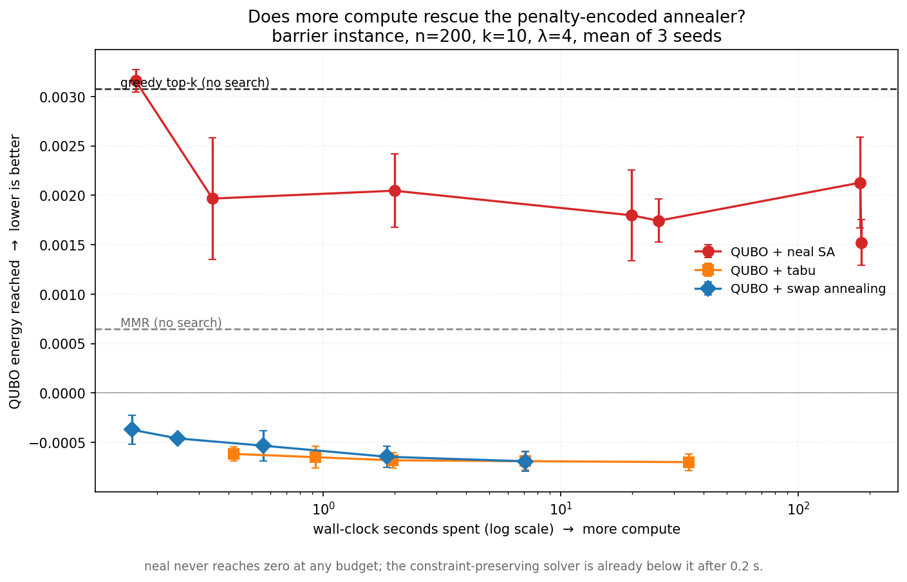

# Findings in detail

The [README](../README.md) states the findings and the headline numbers. This file is
the evidence behind them: the mechanisms, the experiments that tested each one, and the
places where a claim was measured and then narrowed.

Read the README first. Nothing here restates it — these are the sections a reader reaches
for when they want to know *why* a claim holds, or want to attack it.

---

## The penalty encoding breaks the sampler


The textbook recipe — encode `exactly k` as a penalty `P(Σx − k)²`, hand the BQM to a
simulated annealer — **does not work at realistic candidate-set sizes**, and it fails
*silently*.

The mechanism is structural, not a matter of tuning. Two feasible k-sets are never
adjacent under single-spin-flip moves: getting from one to another means removing an item
and adding another, and the state in between has `k±1` items and therefore costs the full
penalty `P`. So the sampler faces a dilemma with no good side:

- cold enough to resolve the objective → it cannot cross the barrier, and freezes in
  whichever feasible set it first stumbled into;
- hot enough to cross the barrier → the objective is thermal noise.

On Amazon Luxury Beauty (`n=200`, `k=10`) the cardinality term's largest coefficient
ranges from **505 to 4,806** across ten instances (mean ~2,000) against the normalised
objective's **1.0** -- the penalty is scaled per instance from the objective it must
dominate, so it is not a single fixed number. Measured consequences:

- `neal` returns lists of exactly the right length **100% of the time** — the constraint
  is satisfied, so nothing looks wrong.
- Its mean QUBO energy is **worse than a greedy MMR baseline** evaluated on the same BQM.
  A hand-written heuristic beats simulated annealing at minimising the annealer's own
  objective.
- Raising `num_sweeps` 10× makes it **slightly worse, not better** — the giveaway that
  more search cannot help when the search is looking at the wrong scale.
- Lowering the penalty strength does not help either: the barrier height *is* the
  strength, and a strength low enough to cross is too low to enforce the constraint.

Two fixes, both in the repo, both beating `neal` by ~2× on its own objective:

| solver | idea | keeps generic `dimod` sampler? |
|---|---|---|
| `qubo_tabu` | same BQM, same single-flip move set, but with **search memory** | yes |
| `qubo_feasible` | anneal over **k-subsets** via swap moves; the barrier never exists | no |

And one that does **not** fix it, which turns out to be the more informative result —
see [Continuous dynamics fail too](#continuous-dynamics-fail-too).

That `qubo_tabu` also works is what rules out the *formulation* as the culprit: a generic
single-flip sampler can solve this BQM given a strategy that escapes basins deliberately
rather than thermally. The problem is the interaction between penalty encoding and
thermal search, which is why D-Wave ships constrained (CQM) solvers rather than expecting
users to tune penalty weights.

**Why this matters for the quantum framing.** A physical annealer receives the same
penalty-encoded BQM and the same barrier. This result is a concrete, measured argument for
constraint-aware solvers over generic QUBO sampling in recommendation reranking — and a
caution against reporting "QUBO reranking achieves good diversity" without checking
whether the sampler optimised anything at all. A near-random feasible list scores *well*
on diversity and coverage. Reporting only downstream metrics would have hidden this
completely.


## Why not just use an exact solver?


The first question any reviewer asks about a QUBO paper, and the project had no answer
until now. Selecting k items under a linear-plus-quadratic objective and a cardinality
constraint is a mixed-integer program; `experiments/exact.py` builds it with a McCormick
linearisation and hands it to HiGHS, with cardinality as a real constraint (`Σx = k`)
rather than a penalty.

Mean of 3 instances, k=10, λ=4. The exact column is **proven optimal** at every size:

| n | exact (proven) | secs | qubo_tabu | secs | qubo_feasible | secs | qubo_sa | greedy_topk |
|---|---|---|---|---|---|---|---|---|
| 20 | **+0.828** | 0.4 | +1.214 | 1.5 | +1.214 | 0.06 | +2.550 | +6.153 |
| 50 | **−3.913** | 27.6 | −3.132 | 4.1 | −3.417 | 0.19 | +2.250 | +5.689 |
| 100 | **−5.543** | 113.6 | −5.513 | 3.1 | −5.165 | 0.37 | +2.276 | +3.257 |
| 200 | **−6.930** | **642.2** | −6.296 | 2.3 | −5.988 | 0.64 | +1.900 | +1.831 |

**Exact solving is tractable at reranking scale — and impractical anyway.** HiGHS proves
optimality at n=200 in **642 seconds**, against `qubo_feasible`'s 0.64 s: a **1,000×**
gap for a 14% better objective. For an offline batch job that may be the right trade. For
a recommender answering a live request it is not a trade at all.

So the honest recommendation is a decision rule rather than a winner:

- **n ≤ 50, offline:** use the MIP solver. It is exact, and 28 seconds is nothing in a batch.
- **n ≥ 100, or online:** use `qubo_tabu`. At n=100 its objective is within **0.031**
  of the proven optimum in 1/37th of the time; at n=200, within **0.634** in 1/284th.

  These were previously quoted as "99.5% of the proven optimum" and "91%". That figure
  was a quotient of two *signed* energies whose zero is arbitrary -- add a constant to the
  objective and the percentage moves. The same formula gives **146.6%** at n=20, where the
  optimum happens to be positive, which is why that column was never quoted. Absolute gaps
  are reported instead, and `experiments/exact.py` now also prints an offset-invariant
  recovered fraction anchored between a random feasible set (0%) and the optimum (100%).
- **Never use penalty-encoded `neal`.** At n=200 it scores +1.900 against greedy top-k's
  +1.831 — *worse than a method that does no search at all*, now measured against a
  proven optimum rather than against other heuristics.

**This also corrects an earlier claim in this README.** The optimality experiment found
tabu and swap annealing *exactly* optimal, but that was at n≤30 with k=5, where
enumeration is possible. Against proven optima at realistic sizes they are near-optimal
and **degrade with n** — the gap to proven optimum grows from 0.031 at n=100 to 0.634 at
n=200. "Exactly optimal" was true of the regime it was measured in and false as a general
statement.


## When does the fairness advantage actually exist?


Three formulation choices were made early and never revisited: equal group targets,
k=10, and n=100–200. `experiments/ablation.py` varies each. One of them substantially
qualifies the headline claim, which is what ablations are for.

**k must not divide evenly by the number of groups.** With 4 groups:

| k | k / \|C\| | quota-MMR parity | QUBO parity | QUBO advantage |
|---|---|---|---|---|
| 5 | 1.25 | 0.5308 | **0.2983** | **+0.2325** |
| 10 | 2.5 | 0.2525 | **0.1992** | +0.0533 |
| 20 | **5.0** | 0.0333 | 0.0332 | **+0.0001** |

At k=20 the advantage **vanishes entirely**. The mechanism is exact: quota-MMR assigns
floor/ceil quotas per group and fills them greedily without backtracking. When k divides
evenly there is no remainder to allocate, so greedy *is* optimal and there is nothing
left for global optimisation to win. When it does not divide, the remainder must be
distributed across groups, and that is a decision greedy makes locally and badly.

So the honest form of the headline claim is narrower and more useful than "the QUBO is
fairer": **it wins when `k / |C|` is not an integer, and the advantage grows with how
awkward the remainder is.** A practitioner with k=20 and 4 groups should use quota-MMR
and save the compute.

**The target definition is free, and the naive quota heuristic cannot change it.** Equal
targets give
every group `k/|C|` slots; proportional targets match each group's share of the candidate
set. Scoring under both — necessary, since scoring a proportional-target solver against
equal-target parity rigs the comparison, which the first version of this ablation did:

| optimised for | method | NDCG | parity[equal] | parity[prop] |
|---|---|---|---|---|
| equal | qubo_tabu | 0.8983 | **0.1992** | 0.2628 |
| equal | quota_mmr | 0.8682 | 0.2525 | 0.2928 |
| proportional | qubo_tabu | 0.9295 | 0.3583 | **0.1090** |
| proportional | quota_mmr | 0.8682 | 0.2525 | 0.2928 |

Each formulation wins on its own metric — the QUBO honours whatever target vector it is
given. But note `quota_mmr` is **identical in both rows**: it cannot express proportional
targets at all. `QuotaMMR` hard-codes one notion of fairness, whereas the QUBO takes an
arbitrary target vector, which is where per-seller contracts or regulatory quotas would go.

**This is an argument against that heuristic, not for the QUBO.** An earlier version of
this section called it "the strongest case for the approach that this project has". It is
not: `BalancedQuota` also reads the target vector, and on the real-category benchmark it
reaches the same 0.20 the QUBO does. Expressiveness distinguishes *apportionment* from
*round-robin quotas*; it does not distinguish the QUBO from apportionment.

<a id="proportional-targets"></a>

### The expressiveness argument, measured on real categories

The table above is a constructed instance, so it shows that the two formulations *can*
differ, not that the difference matters on data anyone would deploy against. Amazon's
metadata export supplies the missing piece: the filtered Software catalogue splits into
real product categories of genuinely unequal size — Digital Software 121, Antivirus &
Security 116, Business & Office 77, and a pooled remainder — and the natural target for
such a partition is proportional, not equal.

Run under the full disjoint-split protocol (3 seeds, 80 users, every method tuned over
its own grid), the expressiveness gap stops being an abstraction:

| method | reach, equal targets | reach, proportional targets |
|---|---|---|
| greedy_topk | never | never |
| mmr | never | never |
| quota_mmr | **0.30** | **never** |
| qubo_tabu | 0.20 | 0.20 |
| qubo_feasible | 0.20 | 0.20 |

`quota_mmr` does not merely get worse. It stops being able to meet *any* budget below
1.00, at any setting of its own `mmr_lam`, while both QUBO variants are unmoved — and
`qubo_tabu` is simultaneously the most accurate method at its reach (0.9500 against
`quota_mmr`'s 0.9147). This is the only benchmark in the repository where a QUBO variant
wins both axes outright.

**The control, and why it was necessary.** The obvious objection is that real categories
are simply a harder partition than popularity tiers, and that the target vector has
nothing to do with it. `configs/amazon_software_category_equal.yaml` isolates that: same
catalogue, same partition, same grids, same seeds, with `targets_mode` the only line
changed. Its prediction was written into the config file *before* the run — that
`quota_mmr` should recover to roughly the 0.25–0.30 it reaches on every equal-target
benchmark, and that if it did not, the proportional-target explanation was wrong and the
finding would be withdrawn.

It recovered, on all three seeds, by more than a factor of two on the same selections:

| seed | parity vs declared (proportional) | parity vs equal share |
|---|---|---|
| 0 | 0.6080 | 0.2650 |
| 1 | 0.5908 | 0.2600 |
| 2 | 0.5885 | 0.2575 |

So the mechanism is identified rather than asserted. Quota-MMR allocates integer quotas
round-robin, which is near-optimal when every target is `k/|C|` and structurally unable to
represent targets of 3.6 / 1.15 / 0.95 / 4.3. Its fairness machinery drives it toward
equal share and therefore *away* from the stated requirement — which is why it is also
beaten by plain `mmr` on parity at some budgets here. The QUBO consumes the target vector
as an input and needs no modification at all.

Both readings of parity are reported in the CSVs (`exposure_parity` against the declared
targets, `exposure_parity_equal` against equal share) so this claim can be checked rather
than taken on trust. That column exists because the first version of this experiment
scored proportional-target runs against equal-share parity — the same error, in the same
place, as the first version of the ablation above.

**Candidate-set size changes little.** Across n = 50/100/200 the ranking is stable except
for the `qubo_feasible` vs `quota_mmr` swap already known to be within noise. `qubo_tabu`
holds up (0.9153 → 0.8981) while `qubo_feasible` degrades faster (0.9006 → 0.8435),
consistent with the barrier growing with n.


## Measured against the true optimum


Every comparison above is *relative* — one solver's energy against another's. That
supports "`neal` is worse than tabu" but not "`neal` recovers 77% of what was available",
and the second is a far stronger thing to be able to say.

At small `n` the optimum is not a matter of opinion: choosing k items from n admits
`C(n, k)` subsets — 65,780 at n=26, k=5 — so enumerating them gives the exact minimum.
`experiments/optimality.py` does that and scores every solver as a **fraction of the
available improvement recovered**, anchored between a random feasible set (0%) and the
true optimum (100%).

n=22, k=5, λ=4, 12 instances:

| method | % recovered | exactly optimal | feasible |
|---|---|---|---|
| **qubo_tabu** | **100.0%** | **100%** | 100% |
| **qubo_feasible** | **100.0%** | **100%** | 100% |
| qubo_sa | 80.1% | 0% | 100% |
| mmr | 75.3% | 0% | 100% |
| quota_mmr | 67.1% | 0% | 100% |
| qubo_sb | 18.9% | 0% | **50%** |
| greedy_topk | 14.4% | 0% | 100% |
| *random_feasible* | *0.0%* | — | 100% |

**Both constraint-preserving solvers are exactly optimal on every instance at this size**
— not merely better than a broken one — and `tests/test_optimality.py` pins it so a
regression cannot pass quietly. Note the qualifier: this holds at n≤30, k=5. Checked
against a MIP solver's proven optima at realistic sizes, they are near-optimal rather
than optimal, and the gap grows with n (0.031 at n=100, 0.634 at n=200). See
[Why not just use an exact solver?](#why-not-just-use-an-exact-solver).

**And the barrier grows with n, exactly as the mechanism predicts.** The penalty scales
with the number of variables while the objective does not, so `neal` should degrade as
the problem grows. It does, monotonically:

| n | 14 | 18 | 22 | 26 | 30 | 200 |
|---|---|---|---|---|---|---|
| `qubo_sa` recovered | 87.7% | 82.0% | 80.1% | 74.7% | 75.2% | *worse than no search* |
| `qubo_tabu` | **100%** | **100%** | **100%** | **100%** | **100%** | — |
| `qubo_feasible` | **100%** | **100%** | **100%** | **100%** | **100%** | — |

At n=14 the encoding is survivable and `neal` recovers most of the objective. By n=200 —
the size an actual reranker faces — it has fallen below a single deterministic MMR pass.
The constraint-preserving solvers are flat at 100% across the whole range.

This also explains why the failure is so rarely reported: **at textbook scale the penalty
encoding works well enough to look fine.** It breaks at the sizes that matter.


## Is it just a budget problem?


The obvious objection to everything above is the cheap one: **you did not run it long
enough.** Every other result here uses one budget per solver, so on that evidence alone
the objection is unanswerable. `experiments/sensitivity.py` answers it.

Each solver is run across three orders of magnitude of compute and scored on **QUBO
energy** — the objective the sampler is minimising, computed from the same BQM it was
handed. Energy rather than NDCG deliberately: NDCG depends on the evaluation protocol and
could be argued about, whereas a solver that loses on the energy it was minimising has
lost on its own terms.

Mean of 3 seeds, barrier instance, n=200, k=10, λ=4:

| solver | budget | QUBO energy ↓ | secs |
|---|---|---|---|
| *greedy_topk* | *no search* | *+0.00308* | *0.00* |
| *mmr* | *no search* | *+0.00065* | *0.03* |
| qubo_sa | 10 reads × 100 sweeps | +0.00316 | 0.2 |
| qubo_sa | 100 × 100 | +0.00197 | 0.3 |
| qubo_sa | 100 × 1,000 | +0.00205 | 2.0 |
| qubo_sa | 100 × 10,000 | +0.00180 | 19.9 |
| qubo_sa | 100 × **100,000** | +0.00213 | **182.5** |
| qubo_sa | 1,000 × 10,000 | **+0.00152** | 184.4 |
| **qubo_tabu** | 5 restarts | **−0.00062** | **0.4** |
| qubo_tabu | 1,000 restarts | −0.00070 | 34.6 |
| **qubo_feasible** | 2 restarts × 30 sweeps | **−0.00037** | **0.2** |
| qubo_feasible | 32 × 480 | −0.00069 | 7.1 |



**`neal` never crosses zero at any budget.** Its best result anywhere — 1,000 reads ×
10,000 sweeps, over three minutes — is **+0.00152**, which is still worse than MMR's
**+0.00065**, a single deterministic pass that performs no search whatsoever. Meanwhile
`qubo_feasible` is already at −0.00037 after **0.2 seconds**, a ~900× smaller budget.

**More compute is not merely useless for `neal`; it is sometimes actively harmful.** On
one seed, 100 reads × 10,000 sweeps reaches +0.00127 in 19 s while the *same* reads at
100,000 sweeps reaches +0.00260 in 183 s — ten times the compute, twice as bad. That is
the barrier making a prediction and the measurement confirming it: a longer anneal is a
*colder* one, so it freezes harder into whichever feasible set it first stumbled into.

Two smaller observations, both consistent with the explanation:

- **`qubo_tabu` is essentially flat** — −0.00062 at 5 restarts, −0.00070 at 1,000. It
  finds its answer immediately and more search buys nothing, which is what a method that
  is *not* fighting the landscape looks like.
- **`qubo_feasible` converts compute into quality monotonically** (−0.00037 → −0.00069).
  It is the only solver here whose curve behaves the way a search algorithm should.

So the budget objection is closed: the barrier is not a resourcing problem, and no amount
of annealing fixes an encoding whose relevant structure sits below the penalty scale.


## Continuous dynamics fail too


The barrier argument above is about **move sets**: two valid k-item lists are never
adjacent under bit flips, so a single-flip sampler has to climb the full penalty to get
between them. That argument says nothing about a method with no move set at all.

Simulated Bifurcation (Goto et al., *Science Advances* 2019) is exactly that method. It
gives each variable a position and a momentum, integrates a Hamiltonian system while a
control parameter is ramped until each variable bifurcates toward one of two attractors,
and reads the spins off the signs at the end. In between, the state is a point in
continuous space that is not any particular bit vector — it travels through the interior
of the hypercube rather than along its edges. If the penalty encoding were merely
hostile to *discrete local search*, this should sail past it.

**It does worse than anything else here. On the barrier instance it returns the empty
set** — at 600 and at 2000 steps, in both the ballistic and discrete variants.

The mechanism is different from the barrier, and the conclusion is the same. Penalty-
encoded cardinality couples every pair of items positively, so converting to Ising form
leaves a large *uniform* field: mean **4.7413** with a spread of **0.0024**. The signal
that distinguishes one item from another is 5×10⁻⁴ of the common mode. Every variable
feels essentially the same drive, so they all bifurcate together, and the answer is
"select nothing". Sweeping the penalty strength shows the dependence directly:

| penalty strength | field spread ÷ mean | items selected (target 10) |
|---|---|---|
| 277.8 (the value that enforces the constraint) | 5.0×10⁻⁴ | **0** |
| 27.8 | 5.0×10⁻³ | **0** |
| 8.3 | 1.6×10⁻² | **0** |
| 2.8 | 4.5×10⁻² | 9 |
| 0.8 | 1.2×10⁻¹ | 2 |

Simulated Bifurcation only sees the objective once the penalty falls roughly 100×
*below* the strength needed to enforce the constraint — which is `neal`'s dilemma
restated in continuous form.

**This sharpens the repo's central claim.** It is not that thermal search is the
problem:

| solver | paradigm | outcome |
|---|---|---|
| `qubo_sa` | discrete, thermal | fails |
| `qubo_sb` | **continuous dynamics** | **fails worse** |
| `qubo_tabu` | discrete + explicit memory | works |
| `qubo_feasible` | constraint-preserving moves | works |

What rescues the formulation is not a better search. It is either **memory** or **never
leaving the feasible set**. Two solvers from unrelated paradigms both fail when handed
the penalty encoding unaided, which is a stronger argument for constraint-aware solvers
than either failure alone.

**A caution about this result, since it is a negative one.** A negative result from a
broken implementation is easy to produce by accident, so `tests/test_bifurcation.py`
establishes correctness before it establishes failure: the solver recovers the
exhaustive optimum on 8 of 8 random dense QUBOs, and its QUBO→Ising conversion is checked
numerically. That check earned its place — the conversion had a factor-of-two error when
first written (`J/8` where `J/4` was needed), which is invisible in the output because
the result is still a perfectly plausible Ising problem, just a different one. It is
still possible that a specialist SB implementation with problem-specific tuning would do
better; what is not in doubt is the mechanism, which is a property of the encoding rather
than of any solver.


## The operating point decides the comparison


The headline benchmark below runs at `λ=4, μ=0`, and at that setting every QUBO variant
loses to group-quota MMR on essentially everything. It is tempting to stop there and
report that the classical baseline wins — an earlier version of this README did exactly
that.

It is not a fair comparison. `μ=0` switches the fairness term **off**, so it pits a QUBO
optimising relevance-and-diversity against a baseline with group quotas hard-coded, and
then scores both on group exposure parity. `λ=4` came from `loader.suggest_lam`, a
scale-matching heuristic with no claim to being a good operating point.

Re-run at `λ=0, μ=1` — the region the sweep pointed at — over 5 seeds, 60 users:

| method | NDCG@10 | exposure parity ↓ | ILS ↓ | secs ↓ |
|---|---|---|---|---|
| quota_mmr | 0.8505 ± 0.0203 | 0.2576 ± 0.0034 | **0.0094 ± 0.0008** | **0.16 ± 0.00** |
| **qubo_tabu** | **0.8873 ± 0.0067** | **0.1999 ± 0.0024** | 0.0177 ± 0.0014 | 16.05 ± 0.05 |
| qubo_feasible | 0.8319 ± 0.0039 | **0.1999 ± 0.0024** | 0.0151 ± 0.0015 | 38.91 ± 3.63 |

`qubo_tabu`'s NDCG range `[0.876, 0.893]` and `quota_mmr`'s `[0.814, 0.863]` do not
overlap; neither do the parity ranges, `[0.197, 0.202]` against `[0.254, 0.262]`.

> **The NDCG half of that does not survive.** Both methods here are being run at fixed
> weights — `λ=0, μ=1` for the QUBO, `mmr_lam=0.5` for the baseline — and the QUBO's
> came from inspecting a sweep while the baseline's is simply the repo default. Tune
> both properly, on users held out from the scoring, and `quota_mmr` reaches
> 0.9033 ± 0.0115 against `qubo_tabu`'s 0.9043 ± 0.0109: a tie. The parity gap does
> survive. See [Tuning and evaluation on disjoint users](../README.md#tuning-and-evaluation-on-disjoint-users),
> which is the comparison to read. This section is kept because the `λ=4, μ=0` versus
> `λ=0, μ=1` contrast is still the clearest demonstration of how much the operating
> point matters.

Three things stop this being a rescue of the method:

- **`quota_mmr` still wins intra-list similarity outright**, by a non-overlapping margin.
  Whether that matters depends on whether you care about redundancy within one list or
  exposure across groups; they are different goals and the two methods split them.
- **The cost ratio is unchanged**: 16.1 seconds against 0.16, a factor of ~100. Nothing
  here argues QUBO reranking is *practical* at this scale, only that it is not beaten on
  quality.
- **The win is `qubo_tabu`'s, not the QUBO's.** `qubo_feasible` scores 0.832 at the same
  operating point — below the baseline — while being given ~2.4× the wall-clock. A
  formulation-level claim would need both solvers to show it, and only one does.
- **`qubo_tabu` is the solver whose result is least portable.** It stops on a wall-clock
  timeout, so the margin above is partly a property of this CPU; see
  [the note on tabu's stopping criterion](#evaluation-choices-that-change-the-numbers).

**The methodological caveat, which is the real limitation.** `λ` and `μ` were chosen by
looking at a 40-user sweep and then validated on 5 resamples of 60 users from the same
dataset. The resamples are independent draws, so this is not the same as reporting the
best sweep cell — but selection and evaluation still share a dataset. A clean protocol
splits users into disjoint selection and evaluation sets and tunes only on the first.
Until that is done, read this as *the QUBO has an operating point that beats the
baseline on two axes*, not as *the QUBO beats the baseline*. Doing it properly is the
first item in Phase 2, and it matters more than another dataset would.


## What the λ/μ sweep shows on real data


Grid: λ ∈ {0, 1, 4, 16} × μ ∈ {0, 1, 4}, 40 users, all three QUBO solvers
(`results/amazon_lb_sweep.csv`). Baselines for the figure are re-run on the same 40
users and written to `results/amazon_lb_sweep_baselines.csv`.

**The solver is verifiably optimising.** At λ=0, μ=0 the objective is pure relevance, so
the optimum is exactly greedy top-k — and it returns NDCG **1.0000** on a 200-variable
instance. That is the one problem size here whose answer is known independently, and it
gets it exactly right.

**μ does real work here, unlike on the synthetic benchmark.** Turning μ from 0 to 1 moves
exposure parity from 0.929 to **0.199** — its arithmetic floor for 4 groups and k=10 — and
category coverage from 0.635 to **1.000**, at any λ. Popularity tiers are not aligned with
the similarity structure, so the diversity term cannot reach this on its own and the
fairness term has something to do.

**NDCG substantially overstates what fairness costs.** Going from (λ=0, μ=0) to
(λ=4, μ=1):

| | NDCG@10 | recall@10 | parity | cat. coverage |
|---|---|---|---|---|
| λ=0, μ=0 | 1.0000 | 0.3250 | 0.9292 | 0.6354 |
| λ=4, μ=1 | 0.6429 | 0.2750 | **0.1992** | **1.0000** |
| change | −36% | **−15%** | −79% | +57% |

NDCG here is computed against the retrieval model's *own* scores, so it is maximised by
definition when you simply agree with the model — reranking away from it always looks
expensive. Recall is measured against a genuinely held-out purchase. By that measure,
driving exposure parity down by 79% and taking category coverage to 100% costs 15% of
predictive accuracy, not 36%. **Papers that report only NDCG overstate the price of
fairness by roughly a factor of two on this data.** This is the most transferable result
here and it does not depend on the QUBO at all.

**Diversity and individual-item fairness pull against each other.** IBO falls from 0.667
to 0.444 as λ rises 0 → 4. Spreading a list across dissimilar items is not the same as
giving individual items their due exposure, and optimising the first can damage the
second.


## Evaluation choices that change the numbers


Two decisions here are load-bearing, and both were found by looking rather than assumed.

**Lists are presented in descending relevance order.** A QUBO selects a *set*; it says
nothing about display order. The solvers return their sets index-sorted, and NDCG is
position-discounted, so scoring the raw output charges the QUBO methods for an ordering
they never claimed to produce. On the synthetic benchmark that is worth up to **0.09
NDCG** — larger than several of the differences being reported. Every solver's output is
therefore sorted by descending relevance before scoring, baselines included (worth a
further ~0.03 to MMR). The comparison is then strictly about *which items were chosen*.
On the Amazon benchmark this is a no-op, because the loader already returns candidates in
descending relevance order.

**Fairness is reported on axes the QUBO does not optimise.** `exposure_parity` is exactly
what the `μ` penalty targets, so a good score there is close to tautological. The table
therefore also carries Gini, catalogue coverage, and the individual-item measures II-F,
AI-F and IBO from Rampisela et al. (`qubo_rerank/metrics/dpfr.py`, ported from their
MIT-licensed reference implementation and checked against it to 1e-12 in
`tests/test_dpfr.py`). Those are group-agnostic and independent of the penalty, which
makes them the ones worth believing.

**The energy column measures solving only, and is still shaky.** Three things had to be
got right before the numbers meant anything:

- The timer used to start *before* `EmissionsTracker.start()`, which probes the hardware
  and takes seconds — so every solver was charged a constant ~5 s. `greedy_topk` read
  5.4 s for 0.008 s of work.
- Scoring used to happen inside the measured window. Intra-list similarity alone is
  O(k²) in Python per user, which is noise for the QUBO solvers and most of the measured
  time for the baselines. Solving and scoring are now separate passes.
- Runs must not be executed concurrently; CPU contention contaminates both timing and
  energy.
- **The machine must stay on mains power.** Midway through one session this laptop was
  unplugged. On battery the Balanced power plan drops an i5-8350U from ~3.6 GHz turbo to
  a pinned 1.297 GHz, and every measured time rose ~2.8× — `qubo_sa` on the synthetic
  benchmark read 7.3 s before and 20.3 s after, reproducibly, in both regimes. Every
  quality metric was byte-identical across the two: same NDCG to six decimals, same
  Gini. So nothing looked wrong. This is the same failure shape as the penalty barrier,
  and it is worth stating plainly in a repo that reports energy: **the energy column
  moved by a factor of three because a cable came out, and only the energy column
  moved.** Runs that report `seconds` or `kWh` are now taken on AC, and results measured
  in different power states are never put in the same table.

**One solver's `seconds` is not a measurement.** `dwave.samplers.TabuSampler.sample`
defaults to `timeout=20` — 20 ms of *wall-clock* per read, not a fixed amount of search.
`qubo_tabu` therefore runs for a configured budget and stops, which has two consequences
the other solvers do not share: its wall-clock is roughly constant regardless of how fast
the machine is (it moved only 1.09× across the power-state change above, against 2.8×
for everything else), and its **solution quality is hardware-dependent**, because a
slower CPU completes less search inside the same 20 ms.

The unplugged laptop turned that inference into a measurement. The `λ=0, μ=1` repeat
study was run twice by accident — once on battery, once on mains — with identical seeds,
identical data and identical code:

| solver | NDCG on battery (1.3 GHz) | NDCG on mains (3.6 GHz turbo) |
|---|---|---|
| `quota_mmr` | 0.8505 ± 0.0203 | 0.8505 ± 0.0203 |
| `qubo_feasible` | 0.8319 ± 0.0039 | 0.8319 ± 0.0039 |
| `qubo_tabu` | 0.8801 ± 0.0084 | **0.8873 ± 0.0067** |

The two fixed-work methods are identical to four decimal places. The time-boxed one got
**better on a faster CPU**. `qubo_sa` and `qubo_feasible` are specified in sweeps and do
a fixed amount of work; comparing tabu to them on the time axis compares a stopwatch to
a workload, and tabu's quality numbers are only reproducible on comparable hardware.
Pinning `timeout` and reporting it — or switching to a work-based stopping criterion —
is a prerequisite for any cross-machine claim about this solver, and the headline result
in [Section 2](#the-operating-point-decides-the-comparison) is `qubo_tabu`'s, so this
qualifies it directly.

Even then: codecarbon estimates from CPU TDP and utilisation, it is not a power meter,
and below ~0.1 s of work its readings are dominated by noise — the sub-second baselines
here disagree with each other by 100× on kWh while differing by only 10× in wall-clock.
Treat these as a relative comparison between the *slow* solvers on identical hardware,
and not as absolute claims. Wegmeth et al. (below) used a physical meter and are the
right citation for rigorous figures.


## Why not RecBole


The plan called for RecBole's `ItemKNN` to supply `r_i` and `s_ij`. Reading
`recbole/model/general_recommender/itemknn.py` shows the model is a shrunk cosine
similarity plus a top-k truncation — no gradients, no GPU, nothing `torch` actually does.
Pulling in ~2.5 GB of dependency to reach forty lines of sparse linear algebra buys a
dependency, not a capability, so the same formulation is implemented directly against
`scipy.sparse` in `benchmarks/loader.py`. The on-disk format stays RecBole-compatible, so
swapping the real thing back in is a loader change and nothing else.


---

## Synthetic benchmark (n=60, k=10, 25 users)


| method | NDCG@10 | cat. cov. | parity ↓ | ILS ↓ | cat. coverage | Gini ↓ | secs ↓ | kWh ↓ |
|---|---|---|---|---|---|---|---|---|
| greedy_topk | **1.0000** | 0.533 | 1.0773 | 0.3336 | 0.600 | 0.6472 | **0.00** | 1.7e-07 |
| mmr | 0.9502 | **1.000** | 0.5333 | 0.1952 | **1.000** | 0.3516 | 0.02 | **2.0e-09** |
| quota_mmr | 0.9072 | **1.000** | **0.2667** | 0.1524 | **1.000** | 0.2872 | 0.02 | **2.0e-09** |
| qubo_sa | 0.7448 | 0.993 | 0.2960 | 0.1508 | 0.967 | 0.2887 | 7.44 | 2.4e-05 |
| qubo_tabu | 0.8510 | **1.000** | **0.2667** | **0.1312** | 0.967 | 0.2984 | 5.54 | 1.8e-05 |
| qubo_feasible | 0.8585 | **1.000** | **0.2667** | 0.1331 | 0.983 | **0.2696** | 3.96 | 1.3e-05 |

Over 5 seeds (`results/synthetic_repeats.csv`):

| method | NDCG@10 | parity ↓ | Gini ↓ | secs ↓ |
|---|---|---|---|---|
| greedy_topk | 1.0000 ± 0.0000 | 1.0768 ± 0.0158 | 0.6423 ± 0.0050 | 0.00 ± 0.00 |
| mmr | 0.9499 ± 0.0018 | 0.5301 ± 0.0072 | 0.3814 ± 0.0175 | 0.03 ± 0.00 |
| quota_mmr | 0.9110 ± 0.0034 | **0.2667 ± 0.0000** | 0.2877 ± 0.0107 | 0.03 ± 0.01 |
| qubo_sa | 0.7404 ± 0.0105 | 0.3045 ± 0.0208 | **0.2686 ± 0.0243** | 7.29 ± 0.03 |
| qubo_tabu | 0.8652 ± 0.0088 | **0.2667 ± 0.0000** | 0.2877 ± 0.0218 | 5.53 ± 0.00 |
| qubo_feasible | **0.8666 ± 0.0049** | **0.2667 ± 0.0000** | 0.2803 ± 0.0233 | 3.87 ± 0.05 |

`qubo_feasible` trades 0.044 NDCG against `quota_mmr` for a better Gini (0.2803 vs
0.2877) and lower intra-list similarity — a real Pareto trade, but one costing **~130×
the wall-clock**. It does dominate `qubo_sa` outright: +0.13 NDCG, better parity, and
roughly half the time.

The two fixed solvers are indistinguishable here — 0.8666 ± 0.0049 against
0.8652 ± 0.0088 — which is the point of running seeds at all. On a single seed
`qubo_feasible` looks 0.008 better and it would have been easy to write that up as an
ordering.

Two things the λ/μ sweep shows (`results/synthetic_sweep.csv`):

**λ behaves as it should**, and the solver is verifiably optimising. At λ=0 the objective
is pure relevance, so the optimum is exactly greedy top-k — and `qubo_feasible` returns
NDCG **1.0000**, recovering the known answer outright. As λ rises 0 → 16, NDCG falls
1.000 → 0.657 and intra-list similarity falls 0.334 → 0.120.

**μ works, but λ makes it redundant here.** The entire 4×3 grid produces only *two*
distinct `exposure_parity` values: 1.0773 at (λ=0, μ=0), and 0.2667 everywhere else —
which is its arithmetic floor for 6 groups and k=10 (four groups get 2 slots, two get 1).
So μ genuinely fixes parity when nothing else is, but any λ≥1 already drives it to the
floor on its own. The synthetic generator makes items within a category mutually similar,
so diversity and fairness are the same axis by construction and there is no trade-off
curve to trace. This is exactly why the real dataset matters: there, groups are popularity
tiers, which are *not* aligned with the similarity structure, and μ traces a real curve.


## Amazon Luxury Beauty (n=200, k=10, 200 users, λ=4, μ=0)


Recall's ceiling is **0.49** — the fraction of users whose held-out item was in the
top-200 candidate set at all. Read `recall@10` against that, not against 1.0.

| method | NDCG@10 | recall@10 | cat. cov. | parity ↓ | ILS ↓ | cat. coverage | Gini ↓ | AI-F ↓ | IBO | secs ↓ | kWh ↓ |
|---|---|---|---|---|---|---|---|---|---|---|---|
| greedy_topk | **1.0000** | **0.250** | 0.610 | 0.9983 | 0.0523 | 0.326 | 0.8776 | 2.4e-04 | 0.371 | **0.00** | **1.8e-07** |
| mmr | 0.9159 | 0.245 | 0.735 | 0.8233 | 0.0189 | 0.438 | 0.7938 | 1.3e-04 | **0.386** | 0.71 | 2.3e-06 |
| quota_mmr | 0.8369 | 0.225 | **1.000** | **0.2600** | 0.0095 | 0.511 | 0.7333 | 9.9e-05 | 0.329 | 0.71 | 2.4e-06 |
| qubo_sa | 0.4339 | 0.155 | 0.898 | 0.5527 | 0.0019 | **0.685** | **0.5652** | **3.6e-05** | 0.157 | 368.69 | 1.2e-03 |
| qubo_tabu | 0.6653 | 0.210 | 0.882 | 0.5637 | **0.0014** | 0.550 | 0.7074 | 6.2e-05 | 0.300 | 57.67 | 1.8e-04 |
| qubo_feasible | 0.6580 | 0.200 | 0.882 | 0.5443 | **0.0014** | 0.562 | 0.6999 | 5.8e-05 | 0.271 | 112.26 | 3.6e-04 |

Over 5 seeds at 60 users (`results/amazon_lb_repeats.csv`):

| method | NDCG@10 | recall@10 | parity ↓ | Gini ↓ | secs ↓ |
|---|---|---|---|---|---|
| greedy_topk | 1.0000 ± 0.0000 | 0.317 ± 0.103 | 0.9902 ± 0.0698 | 0.9201 ± 0.0156 | 0.00 ± 0.00 |
| mmr | 0.9241 ± 0.0137 | 0.307 ± 0.090 | 0.8189 ± 0.0408 | 0.8759 ± 0.0155 | 0.20 ± 0.01 |
| quota_mmr | 0.8505 ± 0.0203 | 0.283 ± 0.075 | **0.2576 ± 0.0034** | 0.8436 ± 0.0183 | 0.16 ± 0.00 |
| qubo_sa | 0.4749 ± 0.0296 | 0.220 ± 0.089 | 0.5162 ± 0.0300 | **0.7693 ± 0.0306** | 107.67 ± 0.27 |
| qubo_tabu | 0.6915 ± 0.0384 | 0.260 ± 0.085 | 0.5322 ± 0.0170 | 0.8284 ± 0.0272 | 16.88 ± 0.06 |
| qubo_feasible | 0.6881 ± 0.0400 | 0.260 ± 0.085 | 0.5499 ± 0.0282 | 0.8262 ± 0.0260 | 33.34 ± 1.47 |

**At this operating point the classical baseline wins,** and by a wide margin:
`quota_mmr` beats every QUBO variant on NDCG (0.851 vs 0.692), recall, exposure parity
(0.258 vs 0.532) and IBO — in **0.16 seconds against 17**. The fixed solvers rescue the
QUBO from `qubo_sa`'s 0.475 NDCG, but at `λ=4, μ=0` they rescue it into second place.

**This is the wrong operating point, and it is the one this config picks.** `μ=0` means
the fairness term is off, so the QUBO is being scored on group exposure parity while
having been given no reason to optimise it. [Section 2](#the-operating-point-decides-the-comparison)
re-runs it at `λ=0, μ=1`, where the picture reverses. Both tables are real; the
difference between them is a configuration choice, and it is larger than the difference
between the methods.

The table is kept at `λ=4, μ=0` rather than quietly re-run at the flattering setting,
because the gap between the two is the most useful thing on this page.

For the comparison that settles it — every method tuned under the same rule on users
held out from the scoring — see
[Tuning and evaluation on disjoint users](../README.md#tuning-and-evaluation-on-disjoint-users).

Where the QUBO does win — Gini, catalogue coverage, intra-list similarity, AI-F — deserves
scepticism rather than celebration. Every one of those is improved by *spreading selections
around*, which is also what a bad optimiser does by accident. `qubo_sa` "wins" Gini
(0.5824), catalogue coverage (0.667) and AI-F outright, and it is the method demonstrably
closest to picking at random. That is precisely why the energy column and the
solver-energy diagnostics are in this repo: without them, the worst optimiser here looks
like the fairest method.

II-F is not reported per-method above because it barely discriminates: every method lands
between 0.002083 and 0.002138, a 2.6% spread across solvers whose NDCG differs by a
factor of two. Under leave-one-out there is one relevant item per user against a
1,365-item catalogue, so the measure is dominated by the shared sea of zeros — the same
degeneracy flagged in `metrics/dpfr.py`. It is in the CSV; it should not carry an
argument.

**What would change this verdict.** The QUBO is being asked to beat a strong greedy
heuristic on a 200-item candidate set, where exhaustive-ish search has little room to pay
off. The case for it has to come from Phase 3 — larger candidate sets where greedy's
myopia actually costs something, and constraints (per-seller contracts, hard slot quotas)
that MMR cannot express but a QUBO can. On this benchmark, at this size, it does not.


## Trade-off curves


Each panel plots NDCG against one cost axis; the classical baselines are fixed reference
points, computed on the same user sample as the sweep. The question is not whether the
QUBO curve *moves* — any reranker moves — but whether any point on it sits above and to
the left of `quota_mmr` (green star), i.e. more accurate *and* cheaper on that axis.

On group exposure parity it does: `qubo_tabu` at `λ=0, μ=1` reaches NDCG 0.899 at parity
0.199, against `quota_mmr`'s 0.868 at 0.253. That single point is what prompted the
5-seed re-test in [Section 2](#the-operating-point-decides-the-comparison), and it is
the whole reason the headline claim changed. It is also a good argument for drawing the
figure before writing the conclusion: the same data, plotted against matched baselines,
had been sitting in an earlier sweep whose baselines came from a different user sample
and so could not be compared to it at all.

On Gini it does not, at any grid point — and Gini is the axis nothing here optimises.


## Relation to published QUBO recommender work


This is not the first QUBO applied to recommendation. It is worth being precise about
what is new here and what is not, and about how the penalty-barrier result bears on
existing work — carefully, because it bears on it more than is comfortable.

**The prior work.** Ferrari Dacrema, Nembrini, Felicioni and Cremonesi have a line of
papers applying quantum annealing to recommender systems: carousel selection
(RecSys 2021) and feature selection (CQFS, arXiv 2110.05089), among others. CQFS is
open source, and reading it establishes three things directly rather than by inference:

1. **It encodes cardinality exactly the way this project does.** From `core/CQFS.py`:

   ```python
   BQM_k = dimod.generators.combinations(self.n_features, k,
                                         strength=combination_strength, vartype=vartype)
   ```

   That is the penalty encoding — the same `dimod` generator, used the same way.

2. **It samples with `neal`** (`CQFSSimulatedAnnealingSampler`) as well as a QPU.
3. **It also uses tabu**, via `dwave_qbsolv.QBSolv` restricted to `solver='tabu'`.

**What that means, stated carefully.** Point 3 is the interesting one. This project found
independently that tabu recovers what `neal` cannot on the penalty-encoded problem; the
CQFS authors evidently found tabu worth using too. Two groups arriving at the same
workaround from different directions is mild corroboration that the difficulty is real
and not an artefact of this implementation.

Point 1 and 2 together mean the failure mode documented here is **available** in that
setting. Whether it *occurs* there is a different question and this project has not
tested it: feature selection over thousands of features is a different problem shape from
selecting 10 items out of 200, the penalty-to-objective ratio will differ, and CQFS
sweeps `combination_strengths` over a range rather than fixing one. Nothing here shows
their published results are wrong, and this project makes no such claim.

What it does show is that **the diagnostic is missing**. There is no feasibility or
solution-quality check anywhere in the CQFS core: no assertion that the returned
selection has exactly `k` entries, and no comparison of the sampler's energy against a
greedy baseline on the same BQM. Without those, a run in which the sampler returned an
arbitrary feasible set would look indistinguishable from a run in which it optimised —
because the downstream metrics stay plausible either way. That is the substance of the
warning in [Finding 1](#the-penalty-encoding-breaks-the-sampler), and it applies to any
paper in this family, this one included before those checks were added.

**Where this project differs:**

| | prior work | here |
|---|---|---|
| task | feature selection, carousel selection | list reranking with group-exposure fairness |
| cardinality | penalty encoding | penalty encoding **plus** a constraint-preserving solver that avoids it |
| diagnosis | — | the barrier measured four ways, and shown to defeat continuous dynamics too |
| tuning protocol | penalty strength swept on the evaluation data | disjoint tuning/evaluation user splits |
| statistics | — | paired Wilcoxon over users, Holm-corrected |

The honest summary: the *formulation* here is standard and owes its shape to that prior
work. The contributions are the failure analysis, the constraint-preserving solver, the
evaluation protocol, and the fairness-budget framing.

